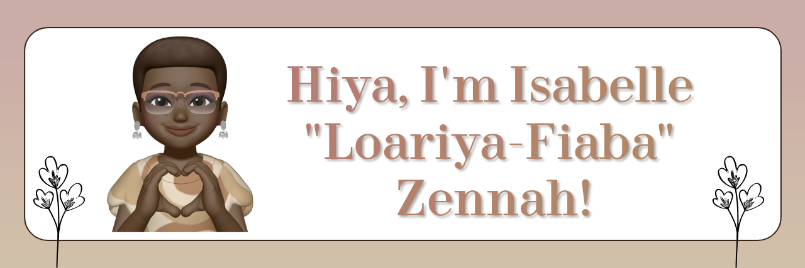

<!-- 

  

 -->

	

https://icons8.com/icon/25157/bookmark

I'm currently achieving my dreams of becoming a developer by starting off as an apprentice at <a href="https://www.griffithsandarmour.com/">Griffiths & Armour</a>, where I was constantly learning and honing my programming skills. But that's not all - I'm also an adventurer at heart! I have a burning passion for exploring new programming languages and creating exciting projects that keep me on my toes! 

To keep my family, friends, and followers updated on my journey, I share my exciting progress on <a href="https://xiacodes.tumblr.com/">my blog</a> and <a href="https://instagram.com/_xiacodes_">Instagram!</a>, where I love to show off my latest projects and give a sneak peek into my daily life. But here's the kicker - I'm not just about self-promotion! I firmly believe in giving back to the community that's helped me along the way. So, I regularly create fun, informative content on <a href="https://xiacodes.tumblr.com/">my blog</a> that covers everything from the latest tech to programming hacks to innovative studying techniques!

<h3>🌷 Currently I am...</h3>
<ul>
<li><b>Learning:</b> React.js, WordPress and creating widgets!</li>
<li><b>Working on:</b> <a href="https://github.com/xiacodes/top-priorities" target="_blank" title="Link to the repo's page!">'Top Priorities' Notion widget</a></li>
</ul>
 
 -----
 

<h3>🌸 Latest Blog Posts</h3>
<ul>
<li><a href="https://xiacodes.tumblr.com/post/717026835870990336/dynamically-vs-statically-typed-programming">Dynamically vs Statically-Typed Programming Languages!</a></li>
<li><a href="https://xiacodes.tumblr.com/post/711694806619963392/fundamentals-of-programming">Fundamentals of Programming!</a></li>
<li><a href="https://xiacodes.tumblr.com/post/711058789559877632/basics-of-html5-lets-build-a-webpage">Basics of HTML5: Let’s build a webpage!</a></li>
<li><a href="https://xiacodes.tumblr.com/post/710424609689862144/technology-stacks-in-software-development">Technology Stacks in Software Development!</a></li>
<li><a href="https://xiacodes.tumblr.com/post/709792289937080320/why-you-should-never-stop-learning-as-a-programmer">Why You Should Never Stop Learning as a Programmer!</a></li>
</ul>
<a href="https://xiacodes.tumblr.com/tagged/xc%3A%20programming%20blog%20post"><i>Read more...</i></a>

-----

	
<h3>🦩 Languages And Technologies</h3>

<h3>Web Development</h3>

	
	
	 

<h3>Programming Languages</h3>

	 
	
	

<h3>Frameworks and Platforms</h3>

  
  
  

<h3>Development Tools and Environments</h3>

  
   
  

<h3>Database</h3>

	 
	 

	

  

    <h3>🩰 GitHub Stats</h3>
   

   
  

    
	 
  

  
   
  
   

  	
  

  

    <h3>🧁 My Favourite Projects</h3>
   

   
  

	  
  	
	
	
	
  

