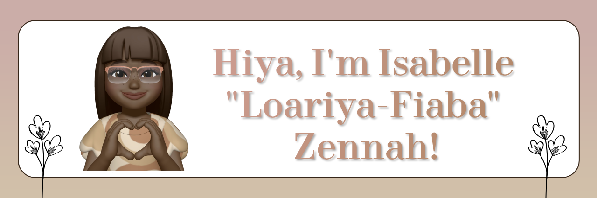

  

	

<!-- The social media badges -->

  
   
  

  
    
  
    
  

-------
<!--

	

<h3>Latest Blog Posts</h3>
  <ul>
	<li><a href="https://xiacodes.tumblr.com/post/711058789559877632/basics-of-html5-lets-build-a-webpage">Basics of HTML5: Let’s build a webpage!</a></li>
	<li><a href="https://xiacodes.tumblr.com/post/710424609689862144/technology-stacks-in-software-development">Technology Stacks in Software Development!</a></li>
	<li><a href="https://xiacodes.tumblr.com/post/709792289937080320/why-you-should-never-stop-learning-as-a-programmer">Why You Should Never Stop Learning as a Programmer!</a></li>
	<li><a href="https://xiacodes.tumblr.com/post/709258248010842112/crud-operations-in-programming">CRUD Operations in Programming!</a></li>
	<li><a href="https://xiacodes.tumblr.com/post/708360967027818496/css-sass-scss-and-less">CSS, Sass, SCSS and LESS?</a></li>
  </ul>

 https://streak-stats.demolab.com?user=xiacodes&hide_border=true&border_radius=10.7&date_format=j%20M%5B%20Y%5D&background=DFD0BB&currStreakNum=86664F&sideNums=86664F&ring=D5AA8B&fire=6D543E&currStreakLabel=CBAF7F&stroke=774F30  

LINKS:
- https://github.com/anuraghazra/github-readme-stats/blob/master/themes/README.md
https://github.com/anuraghazra/github-readme-stats#themes

Add this later!!

 -->
 
 

<h3>Latest Blog Posts</h3>
<ul>
<li><a href="https://xiacodes.tumblr.com/post/711058789559877632/basics-of-html5-lets-build-a-webpage">Basics of HTML5: Let’s build a webpage!</a></li>
<li><a href="https://xiacodes.tumblr.com/post/710424609689862144/technology-stacks-in-software-development">Technology Stacks in Software Development!</a></li>
<li><a href="https://xiacodes.tumblr.com/post/709792289937080320/why-you-should-never-stop-learning-as-a-programmer">Why You Should Never Stop Learning as a Programmer!</a></li>
<li><a href="https://xiacodes.tumblr.com/post/709258248010842112/crud-operations-in-programming">CRUD Operations in Programming!</a></li>
<li><a href="https://xiacodes.tumblr.com/post/708360967027818496/css-sass-scss-and-less">CSS, Sass, SCSS and LESS?</a></li>
</ul>

  

-----

<h2 align="center"> What I am learning in my apprenticeship 📑 </h2>

   
   
  
  

 

<h2 align="center"> Currently learning by myself 🧑🏽‍💻 </h2>

   
   
  
    
   
   

 

<!-- <h2 align="center"> What I want to learn in the future 😎</h2>

  
   
  
   
   
  
  
  

  -->

<h2 align="center"> 💻 IDE </h2>

   
   
  

 

  

    <h3>☕ GitHub Stats</h3>
   

   
  

    
	 
  

  

    <h3>📜 My Favoruite Projects</h3>
   

   
  

  	
	
	
  

